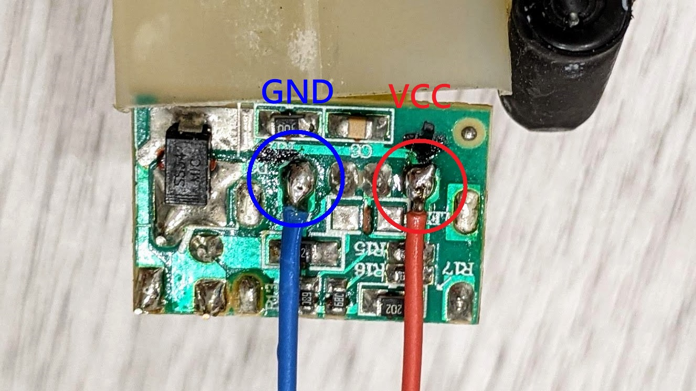

# 電風扇繼電器控制

[](https://youtu.be/v56RkTjVR18)

## MQTT 韌體程式

> [fanboxy.ino](fanboxy.ino) 程式，需要設定 Wifi 網路 SSID 名稱與密碼，並使用 `MQTT` 通訊協定，在 `Home Assistant` 智慧家庭平台上，透過 `Eclipse Mosquitto` 伺服器的帳密來進行連接。

```
const char *ssid = "YOUR_WIFI_SSID";
const char *password = "YOUR_WIFI_PASSWORD";
const char *mqtt_server = "YOUR_MQTT_SERVER";
const char *mqtt_name = "YOUR_MQTT_SERVER_NAME";
const char *mqtt_password = "YOUR_MQTT_SERVER_PASSWORD";
```

## 硬體製作

> 本次使用現成模組，材料很單純簡單，只需要用來控制的 ESP8266 以及 Relay 模組直接組合，最後再拆一顆沒在用的 USB 電供來用即可。

### 使用材料

* ESP8266 (ESP-01S Wifi) 39元


* ESP-01S Relay 模組 35元


* 組合後


* USB 電供 0元


### 觀察電路

> 首先確認電風扇的電源，通常火線是黑色(L)，中性線是白色(N)，或是可以觀察接在控制開關的電源通常也是火線(L)。


### 空間配置

> 由於電風扇的內部空間不大，因此將啟動電容移至右下的空間，將原本的空間讓給控制元件使用，稍微放置後看起來沒有問題。


### USB 電供

> USB 電供可以提供 5V 電源，如果電路板沒有明確的符號說明時，可以由 USB 規範得知 1 為正極電源 (VBUS)， 4 為負極電源 (GND)。

| 接點 | 功能 |
| ---- | ---- |
| 1    | VBUS |
| 2    | D-   |
| 3    | D+   |
| 4    | GND  |


由 Fred the Oyster, CC BY-SA 4.0, https://commons.wikimedia.org/w/index.php?curid=36171492

> 找到電供上的正負極後，可以做個紀錄方便接線時確認。


> 輸入的 110V 電源很容易辨識，直接觀察插頭的接點即可，PCB 板也有印刷符號可以參考。


### ESP8266 與 Relay

> 採用模組的好處，就是接線端子都已經處理好了，只要將電線鎖上即可。由於我希望當控制模組壞掉時，電風扇也能夠正常手動操作，所以 Relay 的部分接在 NC 是預設導通的位置。


### 電路圖

> 控制電路相當單純，讓 USB Power 持續對控制元件供電，讓其可以對電扇電源進行控制即可。


### 焊接與接線

> 焊接直流電線



> 焊接交流電源線


> 焊接火線電源


> 焊接中性線電源


### 組裝

> 將電線都接上端子，做好電路的絕緣固定好位置。


> 鎖上外殼蓋子藏好後，外表看起來跟原本完全相同。


### 後記

> 筆者晚上抱著小孩離開客廳去睡覺前，總是需要彎腰去關電風扇，久而久之對腰部也是一種負擔，因此趁著孩子睡覺時將電風扇改造了一番，解決長久以來的問題。